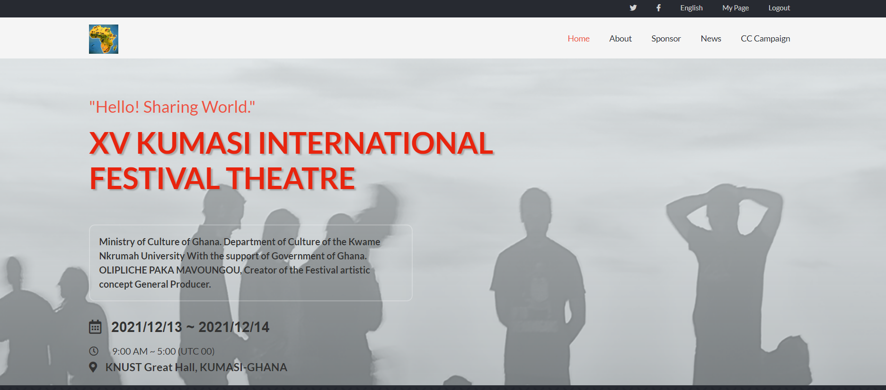
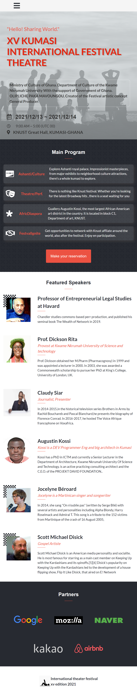

# HTML-CSS-JavaScript-capstone-project

>This Project is called Capstone which simply means Final Project in which I summarize my knowledge in HTML, CSS and 
a little bit of javaScript.

## Project Name
## International Festival Theatre in Kumasi GHANA
 Kumasi is the second capital in Ghana country. Festivals theatre have been going on un kumasi for years now. This Project which
 will come off in December will be held at Kwame Nkrumah University of Science and technology. In this Project, I announce or 
 broadcast the festival with details. The home page tells us about the venue, date and time of the event. also, this page includes names
 of Speakers we expect during the festival. the second page which I named "About Page" gives details of the program and testimonies. 

# The Project presentation video
[Presentation video link](https://www.loom.com/share/f50d19dcc2154e069459e9b9c36941e2)

## Built With

- HTML
- CSS
- Js

## Live Demo
- [Live Demo Link](https://olipliche.github.io/HTML-CSS-JavaScript-capstone-project-/)

## Getting Started
To get a local copy up and running follow these simple example steps.

- You can clone this repo by typing git clone `https://github.com/OLIPLICHE/HTML-CSS-JavaScript-capstone-project-.git` on your terminal
- Type cd `HTML-CSS-JavaScript-capstone-project-` to access the project on the terminal

### Prerequisites
- Text editor
- Git
- Html
- CSS
- Js

## Authors
👤 **Olipliche Mavoungou Paka**
- GitHub: [@githubhandle](https://github.com/OLIPLICHE)
- LinkedIn: [LinkedIn](https://www.linkedin.com/in/olipliche-paka-mavoungou/)

## 🤝⭐️ Contributing

Contributions, issues, and feature requests are welcome!

Feel free to check the [issues page](https://github.com/OLIPLICHE/HTML-CSS-JavaScript-capstone-project-/issues).

## Show your support

Give a ⭐️ if you like this project!

## Acknowledgement
- Thank you [Cindy shin](https://www.behance.net/adagio07) for providing a wonderful design on Behance.
## 📝 License

This project is [MIT](./MIT.md) licensed.